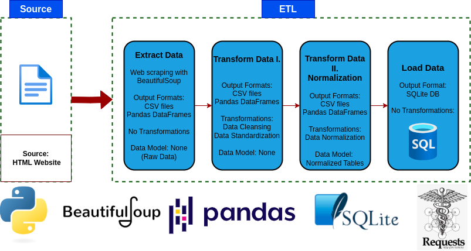

# Python ETL Project: Scraping, Transforming, and Loading Book Data

V1.0 Python and SQLite

## 📌 Summary

This project is a complete ETL (Extract, Transform, Load) data pipeline using Python. The purpose of this script to scrape book-related data from the web, clean, transform and normalize that data, and store it into a SQL database.

The motivation behind this project is to demonstrate a practical, end-to-end data engineering workflow that covers data ingestion, cleaning, transformation, normalization, and storage of the data by widely tools and technologies.

The project begins by **extracting** the data from HTML format through web scraping from [Books to Scrape](http://books.toscrape.com), a publicly available site designed for practicing scraping techniques. The scraped data includes attributes such as book title, price, availability, and genre.

Once the raw data is collected, the **transformation stage** cleans it by:

- Removing duplicates and null values  
- Trimming whitespace and standardizing formats along the table 
- Extracting and normalizing genres into a separate lookup table  
- Splitting book in stock information into it's own table  
- Generating cleaned datasets stored as CSV files

Finally, the **load phase** writes the normalized datasets into a local **SQLite database**.

- `books`: primary book data
- `genres`: genre reference table  
- `in_stock`: current stock status

  

## 🧰 Tech Stack
- **Python**
- **Pandas** 
- **Requests**
- **BeautifulSoup4**
- **SQLite3** 

✅ This project uses only publicly available data for educational purposes.
