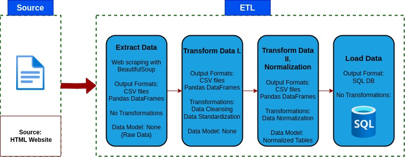
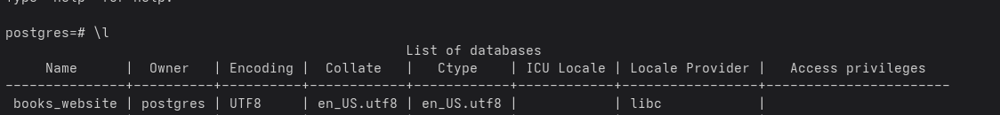
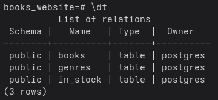
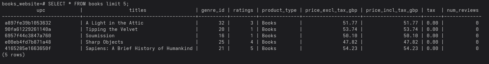
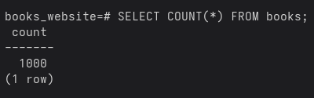

# Python ETL Project: Scraping, Transforming, and Loading Book Data

## 📌 Overview
This project is a complete **ETL (Extract, Transform, Load) pipeline** built in Python.  
It scrapes book data from the web, cleans and normalizes it, and loads it into a SQL database.  
The goal is to demonstrate a practical, end-to-end data engineering workflow using Python and containerization with Docker.

## ⚙️ ETL Pipeline Steps

### 1️⃣ Extract
- Scrapes all catalog pages from [Books to Scrape](https://books.toscrape.com/).
- Retrieves metadata: title, genre, rating, price, stock availability, UPC, and number of reviews.
- Saves raw data to 1_extract_raw_data


### 2️⃣ Transform
- Removes duplicates and null values
- Standardizes data types and formats
- Reclassifies Default and Add a comment genrew into Uncategorized
- Maps rating strings to numerical values
- Cleans currency symbols and parses stock quantities
- Saves cleaned data to 2_transform_data/books_cleaned_data.csv/books_raw_data.csv

### 3️⃣ Normalize
- Extracts a genre lookup table
- Replaces genre strings with foreign key IDs
- Splits in_stock data into its own table
- Saves normalized CSV files to 3_normalized_data/

### 4️⃣ Load
- Loads normalized tables into a SQL database

  


## 🐳 Docker Support

- **v2.0 – Python, PostgreSQL  & Docker Compose Integration**
    The ETL pipeline is containerized with Docker Compose for multi-container deployment, including:
    PostgreSQL database as backend
    Python ETL container

    Build and start containers:
    ```bash
    docker compose up --build
     ```
    PostgreSQL connection is configured via environment variables in docker-compose.yml
    PostgreSQL data is stored in the pgdata named perstistent volume.


    Data inside the PostgreSQL container:

    

    

    

    

  [Exported pg_dump file after the the pipeline run with Docker Compose](v2.0_postgres_docker_compose/data/postgres_dump_data_sql/books.sql)


- **v1.5 – Python, SQLite and Docker**
  
    This ETL pipeline is containerized for easier deployment.

    Build the Docker image:

    ```bash
    docker build -t  v1.5_sqlite
    ```
    Run the Docker container with volumes to map folders inside the container to folders on the host machine:

    ```bash
    docker run -it --rm -v "$PWD/data":/app/data -v "$PWD/logs":/app/logs v1.5_sqlite
     ```


[
](CHANGELOG.md)

## 🧰 Tech Stack
- **Python**
- **Pandas** 
- **Requests**
- **BeautifulSoup4**
- **SQLite3** 
- **Logging**
- **Docker**
- **Pytest**
- **PostgreSQL**

## 🔗 References

- Books to Scrape
https://books.toscrape.com/

- Pandas Documentation
https://pandas.pydata.org/docs/

- BeautifulSoup Documentation
https://www.crummy.com/software/BeautifulSoup/bs4/doc/

- Requests Library
https://docs.python-requests.org/

- SQLite3
https://docs.python.org/3/library/sqlite3.html

- Python Logging Module
https://docs.python.org/3/library/logging.html

- Docker Documentation
https://docs.docker.com/

- PostgreSQL Documentation
https://www.postgresql.org/docs/

✅ This project uses only publicly available data for educational purposes.
