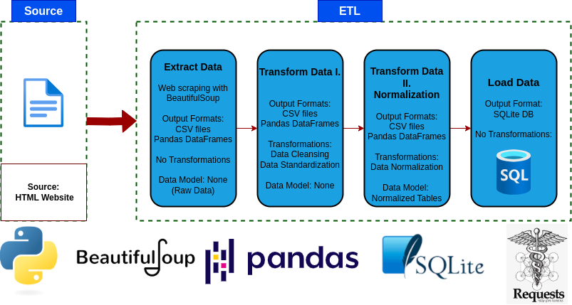

# Python ETL Project: Scraping, Transforming, and Loading Book Data

## 📌 Summary

This project is a complete ETL (Extract, Transform, Load) data pipeline using Python. The purpose of this script to scrape book-related data from the web, clean, transform, normalize that data, and store it into a SQL database. The motivation behind this project is to demonstrate a practical, end-to-end data engineering workflow by widely used tools and technologies.

---
## V1.2 Python and SQLite

1️⃣ Extract
- Scrapes all catalog pages from Books to Scrape
- Retrieves metadata including title, genre, rating, price, stock, UPC, and number of reviews
- Stores raw results as a CSV (1_extract_raw_data/books_raw_data.csv)

2️⃣ Transform
- Removes duplicates and null values
- Standardizes data types and formats
- Reclassifies Default and Add a comment gnere into Uncategorized
- Maps rating strings to numerical values
- Cleans currency symbols and parses stock quantities
- Saves cleaned data to 2_transform_data/books_cleaned_data.csv

3️⃣ Normalize
- Extracts a genre lookup table
- Replaces genre strings with foreign key IDs
- Splits in_stock data into its own table
- Saves normalized CSV files to 3_normalized_data/

4️⃣ Load
- Loads normalized tables into a local SQLite database: 4_database/books.db
- Tables created:
- books: main book data
- genres: genre reference table
- in_stock: stock information

  
---

## How to run

Before running, make sure you have Python 3 installed along with the required Python packages. Once your environment is set up, simply run the pipeline script from a bash terminal by executing:

```bash
python etl_pipeline.py
```

## 🧰 Tech Stack
- **Python**
- **Pandas** 
- **Requests**
- **BeautifulSoup4**
- **SQLite3** 
- **Logging** 

✅ This project uses only publicly available data for educational purposes.
---
🔗 References

- Books to Scrape
https://books.toscrape.com/

- Pandas Documentation
https://pandas.pydata.org/docs/

- BeautifulSoup Documentation
https://www.crummy.com/software/BeautifulSoup/bs4/doc/

- Requests Library
https://docs.python-requests.org/

- SQLite3
https://docs.python.org/3/library/sqlite3.html

- Python Logging Module
https://docs.python.org/3/library/logging.html
